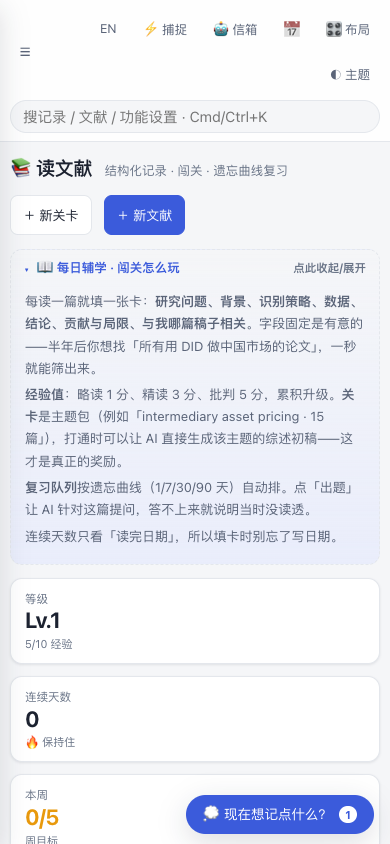

# 学术工作台 · Scholar Workspace

[English](README.en.md) · [安装与使用](docs/安装与使用.md) · [路线图](ROADMAP.md) · [参与贡献](CONTRIBUTING.md)

[](https://github.com/SuperJayLiu/workspace-for-all/actions/workflows/tests.yml)

[](LICENSE)

一个本地优先、零运行时依赖的个人学术工作台：用浏览器管理稿件、期刊、会议、文献、想法和日程，数据始终是你磁盘上可直接阅读的 Markdown 文件。

- 无云端账号、无订阅、无数据库
- Python 标准库后端 + 原生 JavaScript 前端
- 简体中文界面；English beta 可一键切换
- 支持 Zotero、EndNote、Mendeley、BibTeX、RIS、NBIB 和 CSL-JSON
- 可选的 AI 自动任务、学术雷达和私有 Git 多设备同步

> 公共仓库和发布包只含通用示例数据，不含维护者的个人记录、账号、设备信息、路径、密钥或使用历史。

## 界面预览


| 研究项目与投稿流程 | 手机阅读与复习 |
|---|---|
|  |  |

截图来自一次性演示环境，只使用仓库内的通用示例数据和 `Demo device` 设备名。

## 一分钟启动

需要 **Python 3.9 或更新版本**，无需 `pip install`。

```bash
git clone https://github.com/SuperJayLiu/workspace-for-all.git
cd workspace-for-all
python3 server.py
```

浏览器会打开 <http://127.0.0.1:8765/>。首次进入时，设置向导会解释所有可选配置。

也可以下载 [最新 Release](https://github.com/SuperJayLiu/workspace-for-all/releases/latest)，解压后双击：

- macOS：`安装-Mac.command`（安装并设为登录时启动）或 `启动.command`（只运行一次）
- Windows：`安装-Windows.bat` 或 `启动.bat`

发布页同时提供 `SHA256SUMS.txt` 和 GitHub 构建来源证明。校验方法见[安装文档](docs/安装与使用.md#验证下载包可选但推荐)。

## 能做什么

| 模块 | 用途 |
|---|---|
| 稿件流程 | 记录 started → submitted → R&R → accepted，并统计真实审稿周期 |
| 文献库 | 索引常见文献管理器导出文件，链接 DOI、PDF 与文献管理器 |
| 研究网络 | 双向关联想法、稿件、论文、会议和日程 |
| 阅读复习 | 结构化笔记与 1 / 7 / 30 / 90 天复习队列 |
| 自动任务 | 可选的研究体检、周报、方法扫描和文献雷达 |
| 多设备 | 用自己的私有 Git 仓库同步学术数据；本地私密数据不参与同步 |

## 数据与隐私

| 路径 | 内容 | 默认进入 Git？ |
|---|---|---|
| `data/` | 学术记录、配置和通用示例 | 是 |
| `local/` | 密钥、个人生活数据、备份、本机路径和日志 | **否** |
| `attachments/` | 大附件 | **否** |
| `app/` | 无构建步骤的前端 | 是 |

`local/` 和 `attachments/` 已被 Git 忽略。公共打包器还会从 Git 文件清单构建、重置运行状态，并扫描密钥、本机路径和设备状态。

多设备同步时，请新建一个**私有仓库**保存个人数据；不要把个人记录推回本公共源码仓库。

## 测试与开发

```bash
# 14 个 Python 核心套件；不接触真实数据
bash tests/跑全部.sh --python-only

# 6 个浏览器套件（先安装测试依赖）
npm ci
npx playwright install chromium
bash tests/跑全部.sh --ui-only

# 本机默认：核心套件 + 已安装时的浏览器套件
bash tests/跑全部.sh
```

另有一个跨平台启动冒烟测试：

```bash
python3 tests/platform_smoke.py
```

所有会写数据的检查都在临时副本中运行。GitHub Actions 覆盖 Python 3.9/3.13、Linux/macOS/Windows 启动，以及 Chromium、Firefox、WebKit 界面测试。

## 文档与社区

- [完整安装与使用说明](docs/安装与使用.md)
- [English installation guide](docs/installation.en.md)
- [详细使用教程](使用教程.md)
- [参与贡献](CONTRIBUTING.md)
- [路线图](ROADMAP.md) · [更新记录](CHANGELOG.md)
- [安全说明](SECURITY.md) · [行为准则](CODE_OF_CONDUCT.md)
- [测试说明](tests/README.md)

## 已知限制

- English 界面仍处于 beta；部分较少使用的说明文字尚未翻译。
- WebKit 自动化提供 Safari 兼容性信号，但不能替代真实 Safari 和真机测试。
- 局域网访问必须设置访问码，且默认只读。不要把本地服务直接暴露到公网。

## 许可证

[MIT](LICENSE) © 2026 Scholar Workspace contributors
